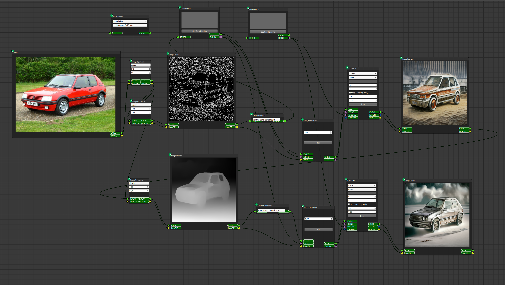

<h1>aiNodes Engine</h1>

Ainodes Engine is a simple and easy-to-use Python-based node engine that is built on top of the popular Qt Node Graph Engine. The project is designed to provide users with an intuitive and user-friendly platform for creating and managing node graphs with ease.

The engine comes packed with various features and functionalities, and some of the backend and nodes are heavily inspired by ComfyUI, a web-based node engine repository.

<h2>Installation / Running the App</h2>

To get started with the Ainodes Engine, follow the steps below:

<ol>
  <li>Clone the repository by running <code>git clone https://github.com/XmYx/ainodes-engine</code> in your terminal or command prompt.</li>
  <li>After cloning the repository, navigate to the root directory of the project.</li>
  <li>On Windows, run <code>run.bat</code> to launch the app, and on Linux, run <code>python launcher.py</code>.</li>
  <li>Once the app is up and running, you can start creating and managing your node graphs with ease.</li>
</ol>

(Optional) create a virtual environment, install requirements, and run <code>python main.py</code>.

<h2>Contributing</h2>

Contributions to the Ainodes Engine are welcome and appreciated. If you find any bugs or issues with the app, please feel free to open an issue or submit a pull request.

<h2>Acknowledgments</h2>

Ainodes Engine is built on top of the Qt Node Graph Engine and is inspired by the ComfyUI web-based node engine repository. We appreciate the contributions of the creators and contributors of these projects.

<h2>License</h2>

This project is licensed under the MIT License. See the <a href="LICENSE">LICENSE</a> file for details.

